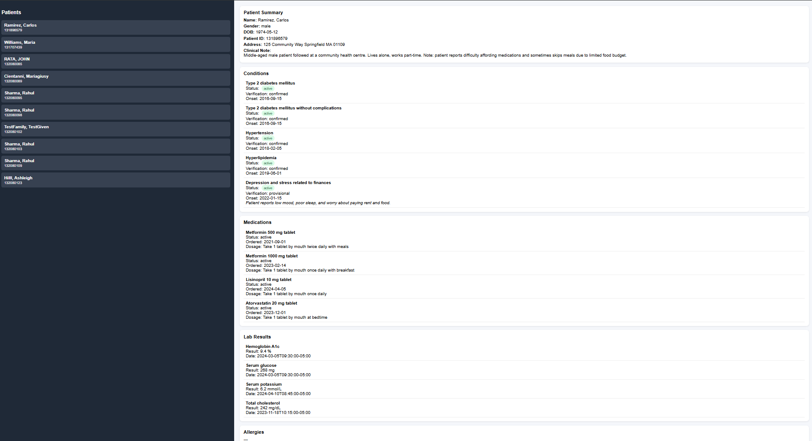

# FHIR Clinical Dashboard v2

A lightweight clinical dashboard built with FastAPI, JavaScript, and HL7 FHIR R4 resources.

This project demonstrates practical healthcare interoperability skills by retrieving and displaying patient data from a public FHIR server.

## Dashboard Screenshot




## Features

* Patient Search & Selection
* Patient Demographics
* Conditions
* Medication Requests
* Laboratory Results (Observations)
* Allergies
* Encounters
* Immunizations
* Procedures
* Care Plans
* Diagnostic Reports

## Technologies Used

### Backend

* Python
* FastAPI
* Requests

### Frontend

* HTML5
* CSS3
* JavaScript

### Healthcare Standards

* HL7 FHIR R4
* RESTful APIs

## Architecture

Frontend (HTML/CSS/JavaScript)
↓
FastAPI Backend
↓
FHIR REST API
↓
HAPI FHIR Public Server

## Installation

Clone the repository:

```bash
git clone https://github.com/YOUR_USERNAME/fhir-clinical-dashboard-v2.git
cd fhir-clinical-dashboard-v2
```

Create a virtual environment:

```bash
python -m venv venv
```

Activate:

Windows:

```bash
venv\Scripts\activate
```

Install dependencies:

```bash
pip install fastapi uvicorn requests
```

Start the API:

```bash
uvicorn app:app --reload
```

Open index.html in your browser.

## API Endpoints

### Patients

GET /patients

### Patient

GET /patient/{patient_id}

### Conditions

GET /patient/{patient_id}/conditions

### Medications

GET /patient/{patient_id}/medications

### Observations

GET /patient/{patient_id}/observations

### Allergies

GET /patient/{patient_id}/allergies

### Encounters

GET /patient/{patient_id}/encounters

### Immunizations

GET /patient/{patient_id}/immunizations

### Procedures

GET /patient/{patient_id}/procedures

### Care Plans

GET /patient/{patient_id}/careplans

### Diagnostic Reports

GET /patient/{patient_id}/reports

## Learning Objectives

This project demonstrates:

* HL7 FHIR resource retrieval
* REST API development
* FastAPI endpoint design
* Frontend/backend integration
* Healthcare interoperability concepts
* Clinical data visualization

## Future Enhancements

* SMART on FHIR OAuth 2.0
* Epic Sandbox Integration
* Cerner Sandbox Integration
* Clinical Timeline View
* Patient Search
* Lab Trend Charts
* Docker Deployment
* Authentication & Authorization

## Author

Edwin Melero

IT Support Specialist | Healthcare IT | HL7 FHIR Enthusiast
